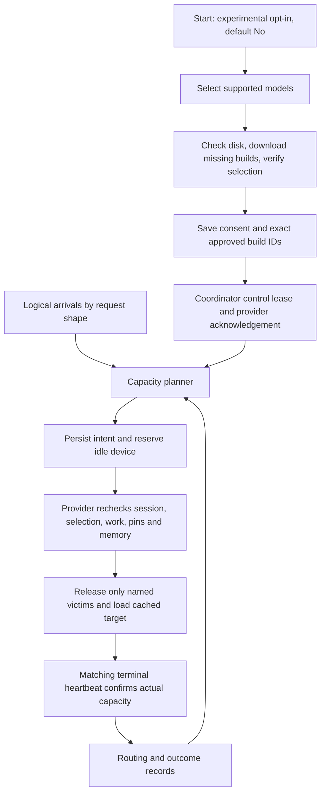

# Experimental model Autopilot

> Last updated: 2026-09-27 · commit `78725b45b`

Autopilot manages memory residency for an explicitly selected set of provider
models. Provider enrollment defaults to off. After selection and verification,
a compatible coordinator activates real demand-based control; a shadow run is
not a prerequisite. Files remain on disk.

## Context

Cached models are not necessarily loaded, and loaded models on one Mac share
its GPU and KV budget. Autopilot moves useful capacity toward qualified demand
while preserving active requests, local reservations, pins and donor coverage.
Initial downloads are a separate, user-authorized setup action.

## Mechanism

### Enrollment and ownership

`Start.resolveAutopilotChoice` asks once on the normal interactive start path.
Blank/EOF means No. `--autopilot` is explicit scripted consent and requires model
selection; `--all` cannot enable it. `saveAutopilotEnrollment` runs after selected
builds are verified and an existing provider has drained. A cancelled picker or
failed download never saves enrollment. Restarts use the saved choice.

`ModelAutopilotSettings.selectedModels` is an exact-build allowlist. An empty list
cannot enroll, and another model appearing on disk cannot expand permission.
The provider rechecks this list before loads, prefetches, advertisements and
network acceptance. Desired-build release updates outside the selection are
ignored; use `darkbloom autopilot models` to approve/download a replacement build.
Selection changes use the existing safe service restart. While enrolled,
`darkbloom switch` directs the operator to `darkbloom autopilot models` or opt-out
so a manual hosted-model transaction cannot bypass the approved selection.
Both operation owners reject overlap, including model-switch validation. Pause, resume, pins and
disable update a config revision consumed by the running daemon's capacity poll.

Protocol 2 separates `enabled` consent from `active` control. The coordinator
sends `model_autopilot_control` with its connection ID, the approved configuration
revision, and an expiry of three controller intervals plus ten seconds. Only a
matching acknowledged lease transfers normal network cold-load/idle ownership.
Renewals enqueue without waiting on sockets through each connection's bounded
priority lane. A full queue does not extend that provider's coordinator lease;
slow connections cannot serialize renewal of healthy peers or the planning tick.
Absent or expired control restores ordinary serving policy. An explicitly paused
provider retains its resident set and accepts network work only on ready models.
An accepted operation retains ownership until it finishes even after opt-out,
pause, connection loss or lease expiry; newer commands cannot overlap it.

The local diagnostic phases are `off`, `waiting`, `active`, `paused`,
`transitioning`, and `recovering`. `darkbloom autopilot status` distinguishes
configured and live state. The account provider endpoint includes the live
snapshot; the admin endpoint exposes controller status and recent operations.
CLI freshness allows four configured half-heartbeat writes, with a ten-second
minimum, matching the other daemon diagnostics.

### Demand and placement

`beginAutopilotDemand` creates a request-owned observation after entering an
inference endpoint. Admission arms it only after public authentication, account
limits, balance and parsing checks. Retries and speculative attempts annotate
the same observation; terminal consumption occurs once. Owner/private traffic,
account rejections, invalid requests and coordinator lock saturation do not
create placement pressure. Structural provider memory/token refusals remain
supply demand; canonical context violations are intrinsically invalid.

`autopilotShapeKey` splits exact model builds by vision/tools/constraint flags,
eight prompt-size bins, four output-limit bins and the resolved first-content
SLA class. Deadline-exempt requests retain that policy; no account identity is stored. The bounded shape tracker
retains no prompts or consumer identities. Ordinary workload moves require at
least eight observations over three occupied ten-second buckets. Initial
bootstrap and protected-floor repairs may act sooner. Shape-specific eligibility
prevents a specialized request from excluding a provider from ordinary traffic.

`autopilotNodeContribution` divides one machine's execution capacity among its
resident workloads. The planner combines offered work and live occupancy with
`max`, avoiding double counting. It debits every retained and removed model on a
machine during a transition, and pending capacity never protects current donor
coverage. Configured warm floors remain protected when the legacy warm-pool
controller is disabled. Positive-benefit additions take precedence over replacements.

Replacement requires minimum residence and a separately reported idle duration.
The provider default is thirty minutes residence and sixty seconds inactivity;
these are conservative initial settings, not measured optimal timers. Standalone
unloading requires the configured quiet window, sufficient other coverage, no
pins and an idle device. A fresh empty enrollment can bootstrap one compatible
model. A model deliberately unloaded after a quiet period is not immediately
reloaded merely because its machine is empty.

### Execution, timing and records

`reserveAutopilotAction` replans under the registry lock against the same session,
capacity sequence and resident set. The command carries exact victims, expected
residents, session and consent revision. The provider checks all guards again,
uses the current load admission path, and disables implicit eviction. Complete
load footprints, native offload allowances, activation reserves and minimum KV
remain authoritative. Optional MTP can fall back to the target alone and cannot
initiate an Autopilot download.

`ModelAutopilotHistory` retains bounded load measurements after unloading and
restart, keyed by exact model ID and verified weight hash. The planner accepts
recent matching measurements and otherwise uses the configured prior. Provider
status records load, release and total operation duration; coordinator records
also include time until the authoritative terminal heartbeat. None is a promise
of an end-to-end latency percentile.

The `autopilot_events` ledger stores idempotent command phases, intended and
actual resident sets, predicted benefit and measured durations. Intent must be
persisted before dispatch. Ledger failure suspends new operations while pending
outcomes remain queued for retry. Existing request-outcome records provide the
completion and first-content evidence for comparisons by model/shape/window.
A command proven not to have entered the writer queue records a failed terminal
phase with unchanged residency. A failed retry cannot erase uncertain delivery.
No causal improvement is inferred from command success alone.

## Invariants

1. Consent is explicit, nonempty and revisioned: `ModelAutopilotSettings.hasConsent`.
2. Session and selection must match before mutation: `ModelAutopilotPolicy.rejection`.
3. Only named idle, unpinned victims can be released: `runModelAutopilot` and `unloadModel`.
4. The provider owns final memory admission: `ensureModelLoaded` and `UnifiedMemoryCap`.
5. Status alone creates no capacity: `reconcileAutopilotHeartbeatLocked`.
6. Operator pause stops new reservations while keeping pending ownership: `SetAutopilotPaused`.
7. An uncertain send or watchdog expiry never implies rollback: `sendAutopilotCommand` and `markAutopilotWatchdogs`.

## Failure modes

A failed setup preserves the running provider and its prior consent. A lost
controller lease restores ordinary policy after any accepted operation finishes.
Disconnect and expired-control revocation re-arm the saved idle monitor; its
ticks continue to defer to accepted commands and an explicit provider pause.
A failed target load may leave fewer residents; the terminal heartbeat reports
that actual state. An ambiguous operation stays fenced until reconciled.
After a coordinator restart, provider registration and paired capacity rebuild
live ownership; historical incomplete ledger phases remain evidence of
uncertainty rather than proof of success. Disk files are never deleted by a
residency decision.

## Code map

| Concern | Source |
|---|---|
| Startup consent and verification | `provider-swift/Sources/darkbloom/StartCommand+Autopilot.swift` |
| Selection and download plan | `provider-swift/Sources/darkbloom/StartCommand+Picker.swift`; `provider-swift/Sources/ProviderCore/Models/ModelDownloader+Selection.swift` |
| Live local controls | `provider-swift/Sources/darkbloom/AutopilotCommand.swift`; `provider-swift/Sources/ProviderCore/Autopilot/ProviderLoop+AutopilotControl.swift` |
| Protocol | `coordinator/protocol/model_autopilot.go`; `provider-swift/Sources/ProviderCore/Protocol/ModelAutopilot.swift` |
| Shapes and planning | `coordinator/registry/autopilot_shapes.go`; `coordinator/registry/autopilot_coverage.go`; `coordinator/registry/autopilot_planner.go` |
| Activation and execution | `coordinator/registry/autopilot_activation.go`; `coordinator/registry/autopilot_commands.go`; `provider-swift/Sources/ProviderCore/ProviderLoop+Autopilot.swift` |
| Durable records | `coordinator/store/postgres_autopilot.go`; `coordinator/registry/autopilot_events.go` |
| Operator view | `coordinator/api/autopilot_handlers.go` |

## Related

- [Operator procedures](../operations/model-autopilot.md)
- [Provider CLI](../provider/cli-reference.md#darkbloom-autopilot)
- [Configuration](../reference/configuration.md#model-autopilot)
- [Protocol](../reference/protocol-messages.md#model_autopilot)
